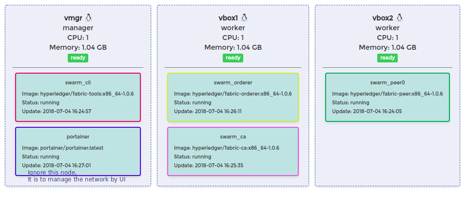

## Description
Deploy the network by docker Swarm.

A [swarm](https://docs.docker.com/get-started/part4/)is a group of machines that are running Docker and joined into a cluster. After that has happened, you continue to run the Docker commands you're used to, but now they are executed on a cluster by a swarm manager. The machines in a swarm can be physical or virtual.

The target deployed swarm network is to be:


## Prerequisites
* [Docker](https://www.docker.com/products/overview) - v1.12 or higher
* [Docker Compose](https://docs.docker.com/compose/overview/) - v1.8 or higher
* [Node.js](https://nodejs.org/en/download/) - v8.9.x or higher

## Prepare
```bash
# Copy binary files for MacOS, and please make sure you run it under root folder of the repository.
test -d "bin" || mkdir -p "bin" && cp ./tools/macos/* "bin"

# for linux ... then
test -d "bin" || mkdir -p "bin" && cp ./tools/linux/* "bin"

# Pull fabric v1.0.6 docker images and tag them as latest
# Go to root folder
./install-docker-images.sh

# Install Node.js packages
# Go to swarm folder
cd swarm
npm install

# Clear up key store
# Go to swarm folder
test -d "hfc-key-store" || mkdir -p "hfc-key-store"
rm -rf hfc-key-store/*
```

## Deployment with swarm by docker-machine
You may use [docker-machine](https://docs.docker.com/machine/overview/) for a quick demo.

Step 1

Get [docker-machine installed](https://docs.docker.com/machine/install-machine/) and [virtualbox installed](https://www.virtualbox.org/wiki/Linux_Downloads) on your local (Linux or Mac)

Step 2

Create 3 boxes called "vmgr", "vbox1", "vbox2"

```bash
docker-machine create --driver virtualbox vmgr
docker-machine create --driver virtualbox vbox1
docker-machine create --driver virtualbox vbox2
```

You will see the output like the following snap if steps above are finished fine:

```bash
docker-machine ls

NAME    ACTIVE   DRIVER       STATE     URL                         SWARM   DOCKER        ERRORS
vbox1   -        virtualbox   Running   tcp://192.168.99.101:2376           v18.05.0-ce   
vbox2   -        virtualbox   Running   tcp://192.168.99.102:2376           v18.05.0-ce   
vmgr    -        virtualbox   Running   tcp://192.168.99.100:2376           v18.05.0-ce   
```
**Notice**
If your IPs are **NOT** 192.168.99.100(vmgr), 101 (vbox1), 102(vbox2).. 
You need to change the actual IP from some JS files:

For example 
```javascript
// For example invoke.js
var channel = fabric_client.newChannel('mychannel');
//var peer = fabric_client.newPeer('grpc://192.168.99.101:7051');
var peer = fabric_client.newPeer('grpc://192.168.99.YourVbox1IP:7051');
channel.addPeer(peer);
//var order = fabric_client.newOrderer('grpc://192.168.99.100:7050')
var order = fabric_client.newOrderer('grpc://192.168.99.YourVmgrIP:7050')
channel.addOrderer(order);
```
You need to change all the IPs in 

```
enrollAdmin.js
registerUser.js
initLedger.js
invoke.js
query.js
```

Basically, the table below illustrate why these 3 boxes are created:

| Machine       | Role          | Node's functionality |
| ------------- |:-------------:| -----:|
| vmgr      | manager | cli |
| vbox1      | worker      |   ca, orderer |
| vbox1      | worker      |   peer  |

Step 3

Login into "vmgr" and make it as the manager.

```bash
docker-machine ssh vmgr

docker swarm init --advertise-addr 192.168.99.100 # Replace with your real vmgr IP
```

You will see a successful message:

```bash
Swarm initialized: current node (ygdqwjvkutc52nh1d9a6toh08) is now a manager.

To add a worker to this swarm, run the following command:

    docker swarm join --token \
      SWMTKN-1-4asgkxrr87z4ljo6o379zd5n4akdahwkloybqlh2jb9o27nxdo-8oy2siex4t6dnvd73gbyngxqk \
      192.168.99.100:2377

To add a manager to this swarm, run 'docker swarm join-token manager' and follow the instructions.
```

Step 4

Login into "vbox1" and "vbox2" and join the network created in step 3

```bash
docker-machine ssh vbox1

docker swarm join --token \
  SWMTKN-1-4asgkxrr87z4ljo6o379zd5n4akdahwkloybqlh2jb9o27nxdo-8oy2siex4t6dnvd73gbyngxqk \
  192.168.99.100:2377 # Change with your local token

exit
```

```bash
docker-machine ssh vbox2

docker swarm join --token \
  SWMTKN-1-4asgkxrr87z4ljo6o379zd5n4akdahwkloybqlh2jb9o27nxdo-8oy2siex4t6dnvd73gbyngxqk \
  192.168.99.100:2377 # Change with your local token

exit
```

Step 5

Get into each docker machine and download the docker images

```bash
docker-machine ssh vbox1 # Change the name and do the pull job in each machine 

docker pull hyperledger/fabric-peer:x86_64-1.0.6
docker pull hyperledger/fabric-orderer:x86_64-1.0.6
docker pull hyperledger/fabric-ccenv:x86_64-1.0.6
docker pull hyperledger/fabric-tools:x86_64-1.0.6
docker pull hyperledger/fabric-ca:x86_64-1.0.6
```
After this step, you will get all the docker images pulled in your boxes.


Step 6
Copy the relevant files into "vmgr", "vbox1" and "vbox2"

```bash
docker-machine ssh vmgr
mkdir fabcar-swarm
cd fabcar-swarm
pwd #Make sure it is /home/docker/fabcar-swarm

# Do the same things for vbox1, vbox2
```
Copy files from local to docker machines:

```bash
docker-machine scp -r -d config/ vmgr:/home/docker/fabcar-swarm/config/
docker-machine scp -r -d crypto-config/ vmgr:/home/docker/fabcar-swarm/crypto-config/
docker-machine scp -r -d chaincode/ vmgr:/home/docker/fabcar-swarm/chaincode/
docker-machine scp -r -d script/ vmgr:/home/docker/fabcar-swarm/script/
docker-machine scp -r -d docker-compose.yml vmgr:/home/docker/fabcar-swarm/docker-compose.yml

docker-machine scp -r -d crypto-config/ vbox1:/home/docker/fabcar-swarm/crypto-config/
docker-machine scp -r -d config/ vbox1:/home/docker/fabcar-swarm/config/

docker-machine scp -r -d crypto-config/ vbox2:/home/docker/fabcar-swarm/crypto-config/
docker-machine scp -r -d config/ vbox2:/home/docker/fabcar-swarm/config/
docker-machine scp -r -d chaincode/ vbox2:/home/docker/fabcar-swarm/chaincode/
```

Step 7
Start up network from "vmgr" (vmgr is a manager node)

```bash
docker-machine ssh vmgr
cd fabcar-swarm
docker stack deploy -c docker-compose.yml swarm
```

You will see the output when finished:

```bash
Creating service swarm_peer0
Creating service swarm_cli
Creating service swarm_ca
Creating service swarm_orderer
```

**Verify** if they are deployed successfully by:

```bash
docker service ls

# You will see something like:
ID                  NAME                MODE                REPLICAS            IMAGE                                     PORTS
9zz67bpieurj        portainer           replicated          1/1                 portainer/portainer:latest                *:9000->9000/tcp
tj8u8721qk6k        swarm_ca            replicated          1/1                 hyperledger/fabric-ca:x86_64-1.0.6        *:7054->7054/tcp
3u2pnqeranor        swarm_cli           replicated          1/1                 hyperledger/fabric-tools:x86_64-1.0.6     
ajj2omhr58ad        swarm_orderer       replicated          1/1                 hyperledger/fabric-orderer:x86_64-1.0.6   *:7050->7050/tcp
nzcivaur1m76        swarm_peer0         replicated          1/1                 hyperledger/fabric-peer:x86_64-1.0.6      *:7051->7051/tcp, *:7053->7053/tcp

```

**Verify** the docker containers in "vmgr":
```bash
# Still in vmgr
docker ps -a

# You will see
CONTAINER ID        IMAGE                                   COMMAND                  CREATED             STATUS                     PORTS               NAMES
4bca8bd7321c        hyperledger/fabric-tools:x86_64-1.0.6   "/bin/bash"              31 minutes ago      Up 30 minutes                                  swarm_cli.1.kutuitjplmm3jrmm7vhhfm3um
```

**Verify** the docker containers in "vbox1":
```bash
# in vbox1
docker ps -a

# You will see
CONTAINER ID        IMAGE                                     COMMAND                  CREATED             STATUS              PORTS               NAMES
507f1bacec3b        hyperledger/fabric-orderer:x86_64-1.0.6   "orderer"                30 minutes ago      Up 30 minutes       7050/tcp            swarm_orderer.1.r2vs4kuljsqzgngtkcn9pflb6
336ef619da3a        hyperledger/fabric-ca:x86_64-1.0.6        "sh -c 'fabric-ca-se…"   31 minutes ago      Up 31 minutes       7054/tcp            swarm_ca.1.v03h24fq9s22qutszyto8g95y

```

**Verify** the docker containers in "vbox2":
```bash
# in vbox2
docker ps -a

# You will see
CONTAINER ID        IMAGE                                                                                                    COMMAND                  CREATED             STATUS              PORTS               NAMES
537690dee889        hyperledger/fabric-peer:x86_64-1.0.6                                                                     "peer node start"        2 minutes ago       Up 2 minutes                            swarm_peer0.1.62zx9qsnkucko6peaz10suw89

```

>If you do not see the happy result above, please use the code to check :
>```bash
> # When you see REPLICAS is 0/1
>docker service ps swarm_cli
> # Or some other service name
>```

Step 8
Install chaincode and instantiate it.

```bash
# Go into vmgr

# Run into cli to execute work on admin_manufacture
docker exec -it `docker ps -f name=swarm_cli* -q` /bin/bash -c 'chmod 777 ./script/script-cli.sh; ./script/script-cli.sh'

# You will see the following message when finished:
2018-07-04 07:15:13.508 UTC [msp/identity] Sign -> DEBU 008 Sign: digest: 4430B1C9A5039C7A224D58753E061E4BEC20B18109A591D96DA4C5D77179A9F7 
2018-07-04 07:15:13.512 UTC [main] main -> INFO 009 Exiting.....
```

**Verify** the new containers created in "vbox2", you will see:

```bash
# In vbox2, docker ps -a, you will see:
dev-peer0.org1.example.com-fabcar-1.0-5c906......
```

## Run your local Node application

Step 1 Enroll admin

```javascript
// Go to swarm folder
node enrollAdmin.js

// You will see successful message like:
/*
Store path:/home/will/Documents/blockchain/blockchain-samples/swarm/hfc-key-store
Successfully loaded admin from persistence
Assigned the admin user to the fabric cli .............
*/

// Certificates will be generated into swarm\kfc-key-store, have a check.
```

Step 2 Register user

```javascript
// Go to swarm folder
node registerUser.js

// You will see successful message like:
/*
Store path:/home/will/Documents/blockchain/blockchain-samples/swarm/hfc-key-store
Successfully loaded admin from persistence.........
*/

// Certificates will be generated into swarm\kfc-key-store, have a check.
```

Step 3 Init some data for test

```javascript
node initLedger.js

// You will see successful message like:
/*
Store path:/home/will/Documents/blockchain/blockchain-samples/swarm/hfc-key-store
Successfully loaded user1 from persistence
Assigning transaction_id:  2c317da58fd93a6f3fa0aaa8904abf49b37d190cacf8b33e7587a022d2c736aa
Transaction proposal was good
Successfully sent Proposal and received ProposalResponse: Status - 200, message - "OK"
*/
```

Step 4 Query the init data

```javascript
node query.js

// You will see the response:
[
  {
    "Key": "CAR0",
    "Record": {
      "make": "Toyota",
      "model": "Prius",
      "colour": "blue",
      "owner": "Tomoko"
    }
  },
  ..........
  {
    "Key": "CAR9",
    "Record": {
      "make": "Holden",
      "model": "Barina",
      "colour": "brown",
      "owner": "Shotaro"
    }
  }
]
```

Step 5 Insert one data

```javascript
node invoke.js

// You will see the response:
/*
Store path:/home/will/Documents/blockchain/blockchain-samples/swarm/hfc-key-store
Successfully loaded user1 from persistence
Assigning transaction_id:  24e03dfa777660a33dd6028a34655f2647bd9f9cee396179b7d1baa7d494a5b4
Transaction proposal was good
Successfully sent Proposal and received ProposalResponse: Status - 200, message - "OK"
*/
```

Step 6 Query again see if the data (Inserted in Step5) was in the ledger

```javascript
node query.js

// You will see the response:
[
  {
    "Key": "CAR10", /*This is a new data*/
    "Record": {
      "make": "",
      "model": "",
      "colour": "",
      "owner": "Bruce"
    }
  },
  ...
]
```

## Close down the network
In Local, clear up the certificates
```bash
# Go into swarm folder
rm -rf hfc-key-store/*
```

In "vmgr" machine, stop the network
```bash
# Go into vmgr
docker stack rm swarm
```

In "vbox2", remove the chaincode containers
```bash
# Go into vbox2
docker ps -a | grep '\<dev-.*' | awk '{print $1}' |xargs -I {} docker stop {}
docker ps -a | grep '\<dev-.*' | awk '{print $1}' |xargs -I {} docker rm {}
docker rmi $(docker images | grep '\<dev-peer0.org1.example.com-fabcar*' | awk '{print $1}')
```